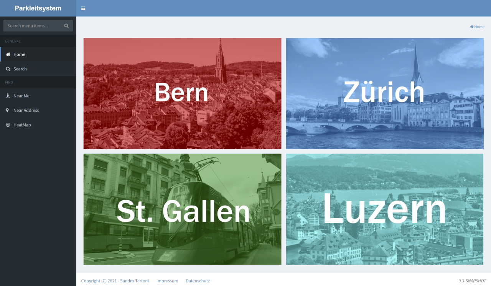
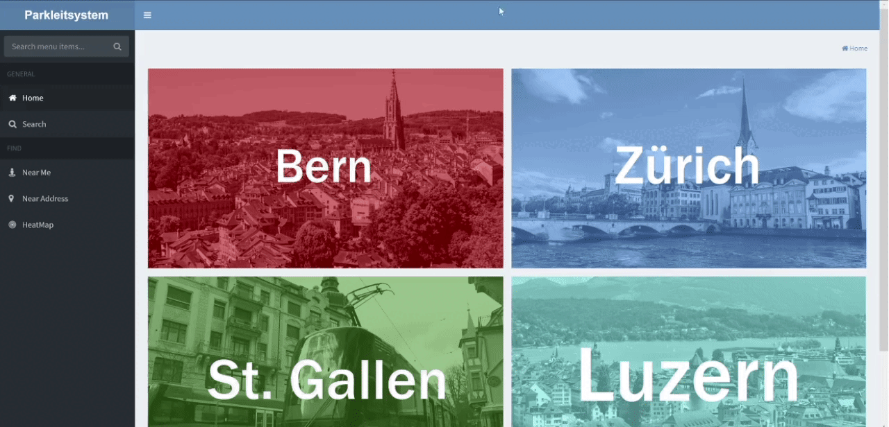

# Parkguidance

This System is designed to receive data from different parking garages in order to sort and log them into its database.
On request, it displays the current capacity and Infos of the hooked-up parking garages and gives a rough estimate of its free capacity throughout the day. 

This project started as a school project for the [Module 151](https://cf.ict-berufsbildung.ch/modules.php?name=Mbk&a=20101&cmodnr=151&noheader=1) at [BBB](https://bbbaden.ch).
The branch [Release-0.1](https://github.com/Neoministein/parkguidance/tree/Release-0.1) was submitted as the finished project.

The project was further developed for a second school project for the VA (Vertiefungs arbeit), independent in-depth work.  
The branch [Release-0.2](https://github.com/Neoministein/parkguidance/tree/release/0.2) was submitted as the finished project.

##Website

The web application is currently live under [www.pls-ch.live/park-guidance/](https://www.pls-ch.live/park-guidance/index)

### Garage-Info

The info page displays the current and max capacity, address, price, contact in-formation about the operators, and a description which shows more detailed information about the parking garage. 
The page also displays an embedded map, and a chart representing the cur-rent free spaces throughout the day.

### Near-Me

The near me page finds the nearest parking garages to the users position and thereafter displays them sorted by the time it takes to arrive at the destination. 
The following data is displayed for ease of use:
- Name of the parking garage
- Link to the parking garage data page
- Current free capacity and occupied spots
- The address
- The distance to the garage
- The time it takes to the garage

### Near-Address

The near address page finds the nearest parking garages to an address and thereafter displays them sorted by the time it takes to arrive at the destination. 
The following data is displayed for ease of use:
- Name of the parking garage
- Link to the parking garage data page
- Current free capacity and occupied spots
- The address
- The distance to the garage
- The time it takes to the garage

### Heat-Map

The heatmap screen displays a map with circles representing parking garages. A slider at the top left of the screen controls the time of day displayed on the map. 
The circle size defines the max-imum capacity, and the color range from green to red representing the capacity at the selected hour. Green is empty, red is full. If no park data was found, the circle color will be grey.
At the bottom of the screen is a button to switch on the color-blind feature, which will switch out green with blue for color scaling.

## Documentation

> Not up to date, last updated for branch [Release-0.1](https://github.com/Neoministein/parkguidance/tree/Release-0.1). 

Click [here](/docs/documentaion.md) to view the documentation.

## Author

* **Neoministein** - *Initial work* - [Youtube](https://www.youtube.com/channel/UCtfBiBXVXqTotONMq6VSMbg) / Discord: Neoministein#1245

## License

No licence has been specified yet.

## Acknowledgments