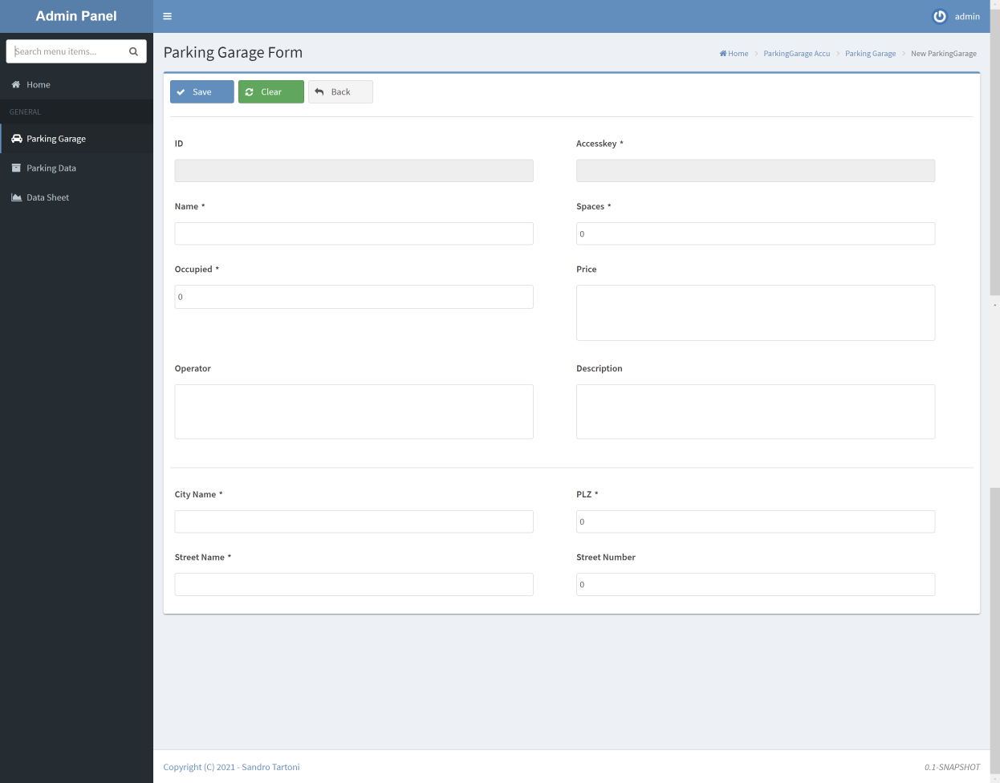
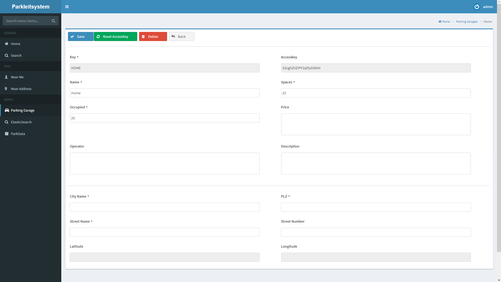
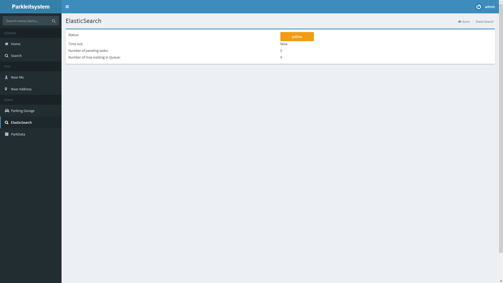
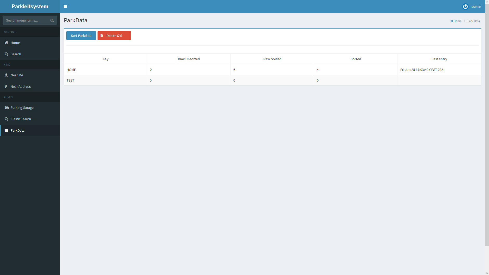

# ParkGuidance-Admin

The admin component contains all pages with which an admin user is going to interact with.

## Interface

You can access the admin web pages at http://localhost:8080/park-guidance/admin/[pagename].

Your access to the pages are blocked at first, and you will be redirected o the [Login Page](#Login-Page).
After successfully entering the username and password you'll be able to travel through the pages freely.

**Note**
> If you want to logout you can do so at the top right of the screen.

### Login Page

#### Concept

The login page should have two input fields, and a button one for the username and one for the password.

#### Product

The front end firstly checks if both username and password aren't null.

After filling out both input fields and clicking on Sign the backend gets notified. 
At first, it checks if the username exists in the database. 
If it exists it hashes the received password from the user and compares it with the one stored in the database. 

If one or both checks returns false the user is displayed a message containing "Login failed".

> There is an autologin in place in which you will be automatically logged in using cookies if you used the "Remember Me" radio button and didn't logout since the last session

> The Forgot Password, and Register are currently only cosmetic and have no backend integration. 

### List Pages

#### Concept

List Pages are a one-to-one representation of what datasets are stored in the database. 
The screen contains 2 Buttons one creates a new dataset and one to delete the selected ones.

When clicking on the name of the dataset you shall be redirected to a form in which you can edit it.

#### Product

The implementation uses a LazyDataModel to only load the shown data from the database

##### ParkingGarages Page

### Form Pages

#### Concept

Form Pages are a one-to-one representation of the selected dataset from the database.

If you are creating a new dataset you'll be able to create, clear or go back with the provided buttons. 

If you are editing an existing dataset you'll be able to save, delete or go back with the provided buttons. 

##### New

##### Edit

#### Product

##### ParkingGarages Page Save

##### ParkingGarages Page Edit

### ElasticSearch Status Pages

#### Concept

The Elastic Search Status Page should display info of the received **_cluster/health** request:

 - status
 - timed_out
 - number_of_pending_tasks
 - number_of_in_flight_fetch
 
#### Product

### ParkingData Pages

#### Concept

The ParkData screen should display all relevant data regarding the parking data in elasticsearch.

It should display these datapoint per Garage in a Table:

- key of the parking garage
- count of raw data entries that hasn't been sorted yet
- count of raw data entries that has been sorted
- count of sorted data entries
- the last raw unsorted data entry has taken place 

The screen should also contain a button which sends an HTTP POST request to the [ParkingData-Sorter Module](parkingdata-sorter.md)
to initiate the sorting of the parking data.

> The button should disable itself if the component isn't available via a ping.

The screen should contain a second button which deletes the raw sorted parking data.

#### Product

 

>Back to  [README.MD](../README.md)

