#ParkGuidance-Admin

The admin module contains all pages with which an admin user is going to interact with.

## Interface

You can access the admin web pages at http://localhost:8080/park-guidance/admin.

Your access to the pages are blocked at first, and you will be redirected o the [Login Page](#Login-Page).
After successfully entering the username and password you'll be able to travel through the pages freely.

**Note**
> If you want to logout you can do so at the top right of the screen.

### Login Page

#### Concept

The login page should have two input fields, and a button one for the username and one for the password.

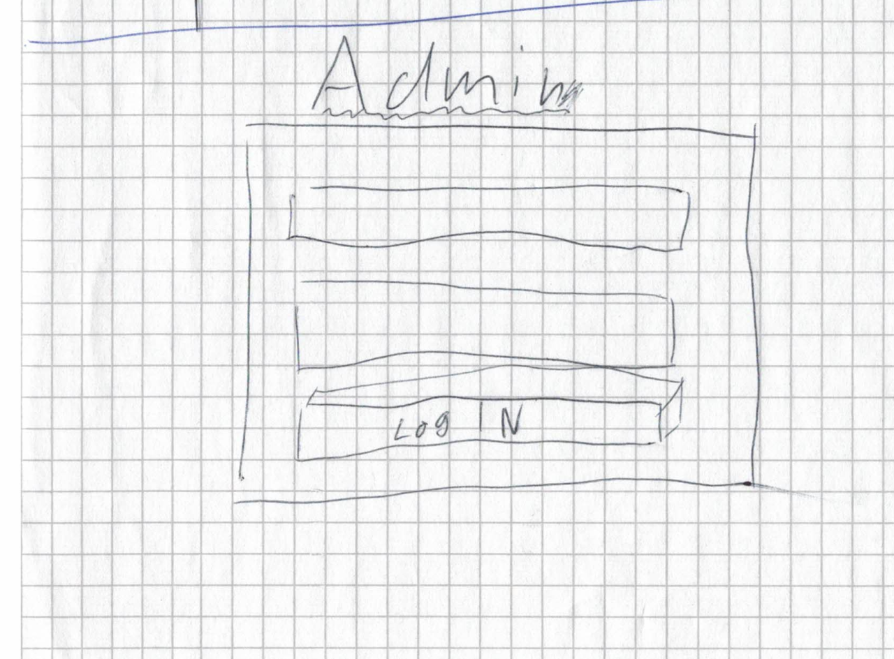

#### Product

After filling out both input fields and clicking on Sign the backend gets notified. 
At first, it checks if the username exists in the database. 
If it exists it hashes the received password from the user and compares it with the one stored in the database. 

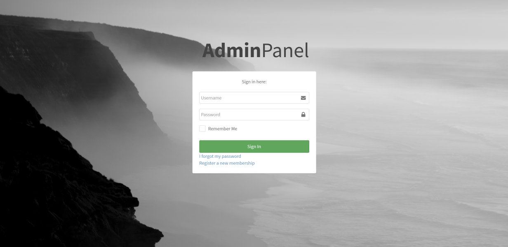

> The Remember Me, Forgot Password, and Register are currently only cosmetic and have no backend integration. 

### List Pages

#### Concept

List Pages are a one-to-one representation of what datasets are stored in the database. 
The screen contains 2 Buttons one creates a new dataset and one to delete the selected ones.

When clicking on the name of the dataset you shall be redirected to a form in which you can edit it.

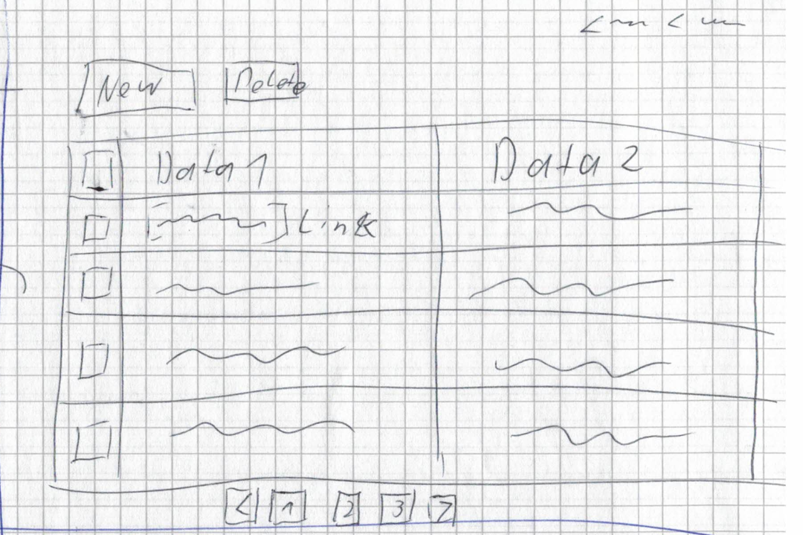

#### Product

##### ParkingGarages Page

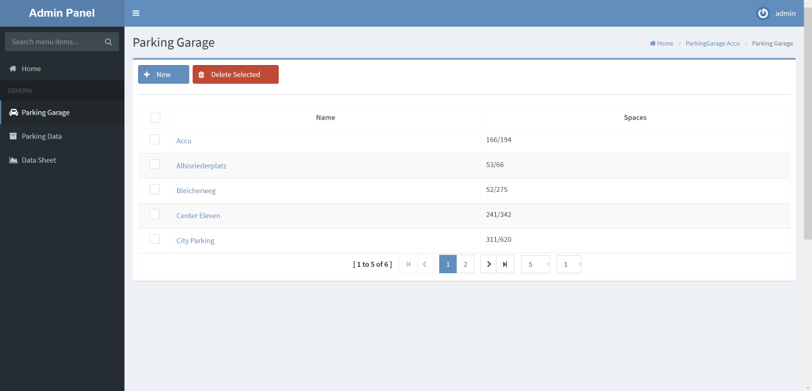

##### ParkingData Page

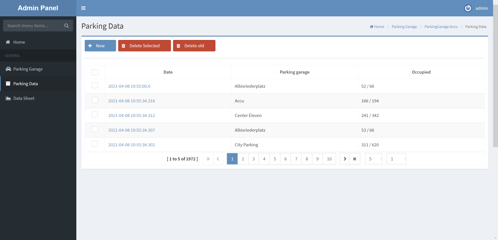

##### Datasheet Page

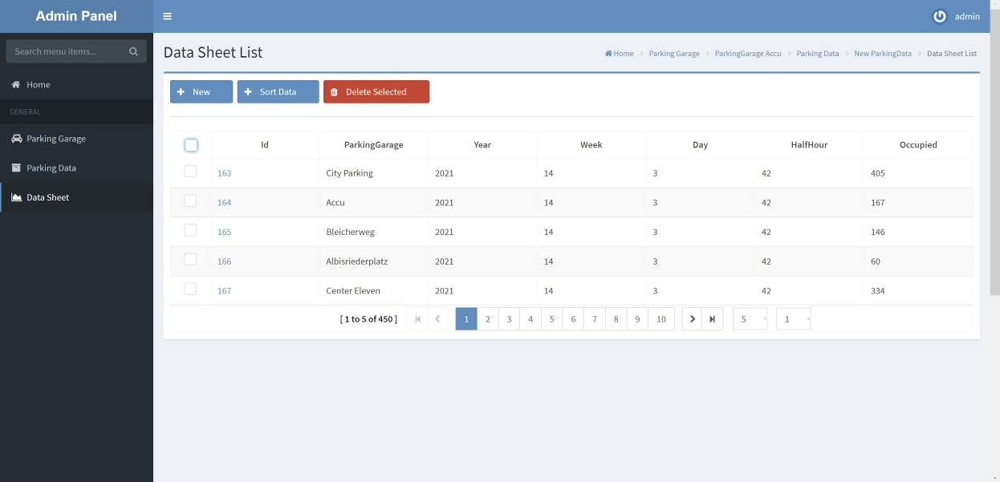

### Form Pages

#### Concept

Form Pages are a one-to-one representation of the selected dataset from the database.

If you are creating a new dataset you'll be able to create, clear or go back with the provided buttons. 

If you are editing a existing dataset you'll be able to save, delete or go back with the provided buttons. 

##### New

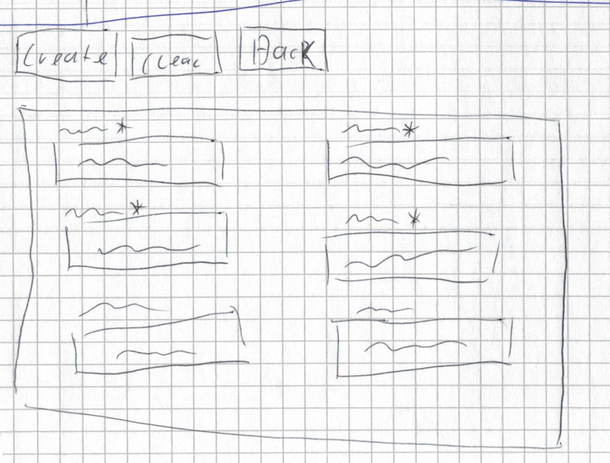

##### Edit

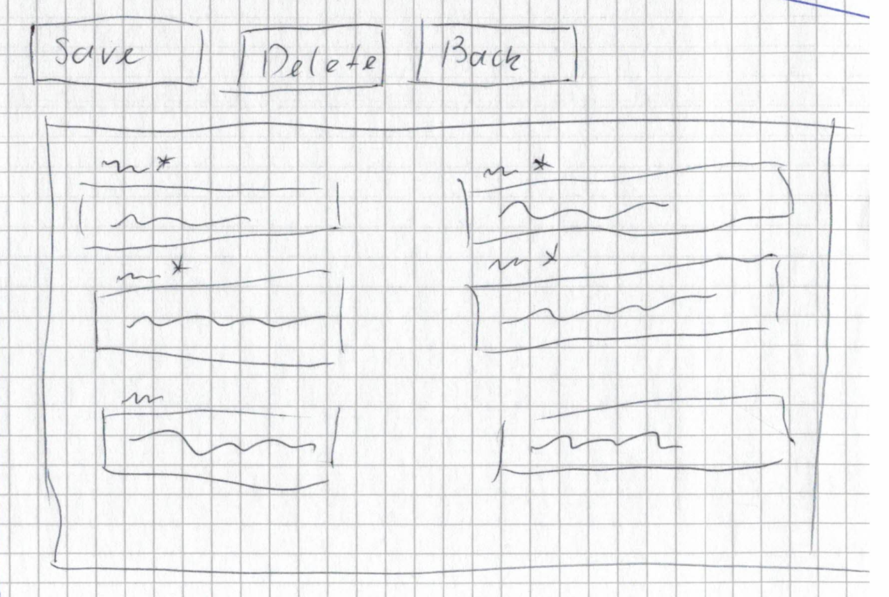

#### Product

##### ParkingGarages Page

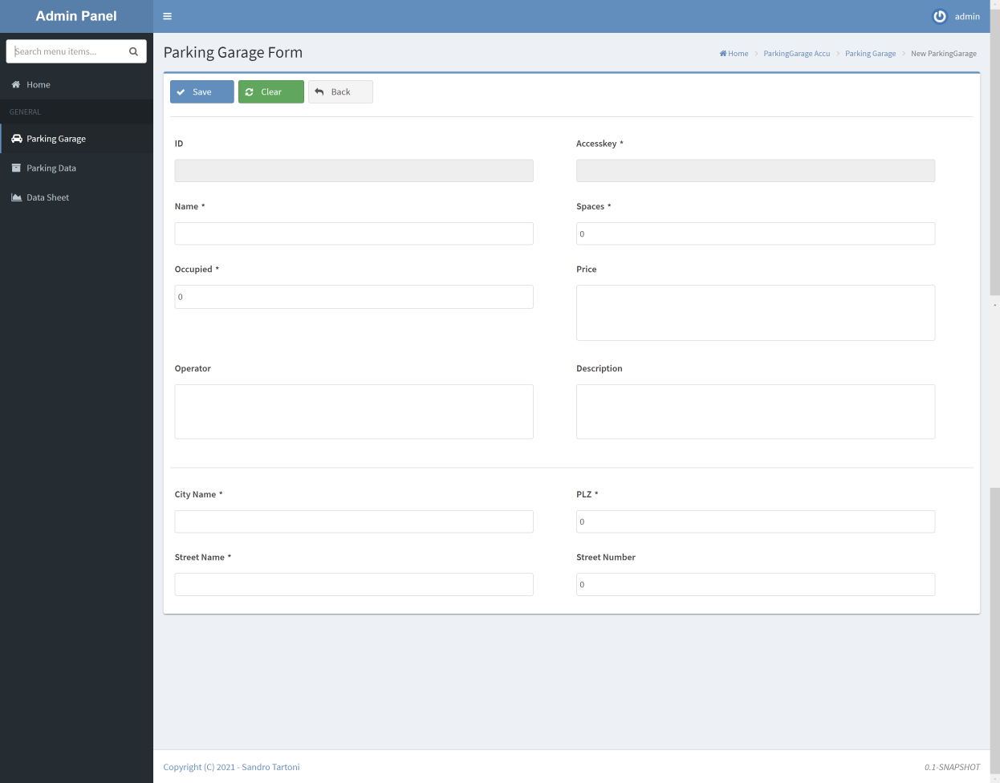

##### ParkingData Page

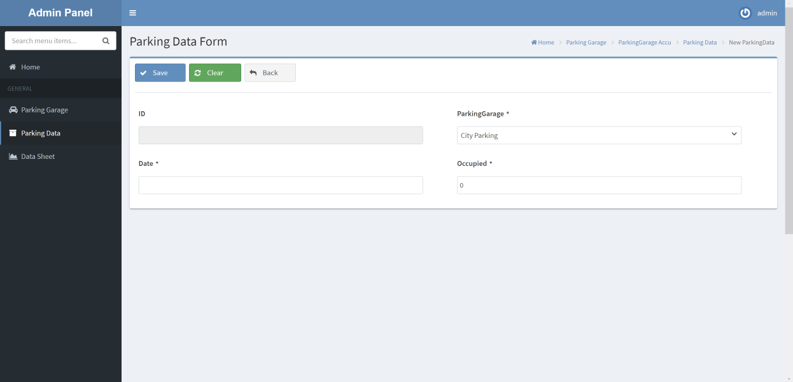

##### Datasheet Page

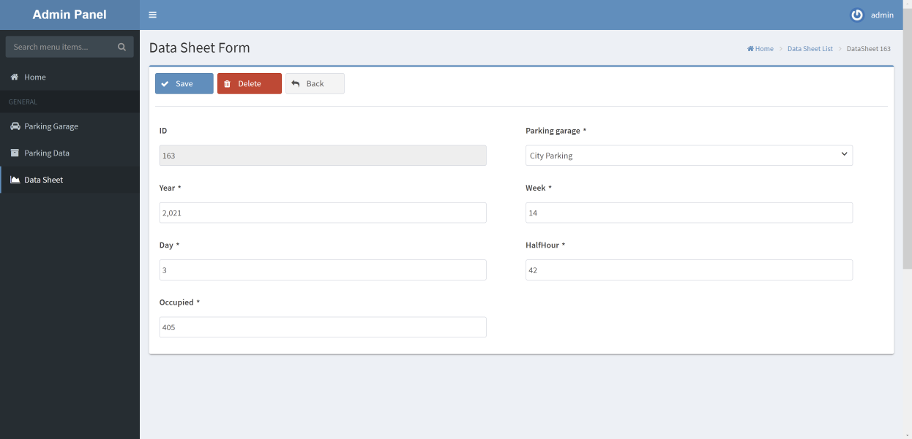

### Additional Infos

#### Parking Data Sorter

In the DataSheetList Screen, there is a button called Sort data. 
This button sends an HTTP POST request to the [ParkingData-Sorter Module](parkingdata-sorter.md) to initiate the sorting of the parking data into a datasheet.

**Note**
> The button is disabled if the module isn't available via a ping.

#### Delete Old

In the ParkingDataList Screen, there is a button called delete old.
If pressed this button goes through the parking data and deletes all entries which have been sorted and are older than 2 Weeks.  

>Back to  [README.MD](../README.md)

