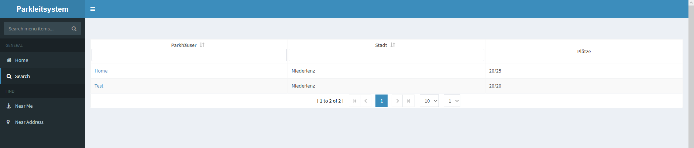

# ParkGuidance-User

The user component contains all pages a normal user will interact with or get in contact with. 

## Interface

You can access the user web pages at http://localhost:8080/park-guidance/.

### Index Page

#### Concept

The index page should have a table containing all parking garages with their max and current capacity.
There should also be a way to click on the parking garage to get to a page with more information.

#### Product

The final screen displays an application scoped table which is updated only every 5 seconds. 

### Parking Garage Data Page

#### Concept

The parking garage data page should display all the relevant data in regards to the selected parking garage.
Under the data lies a chart with the time of day, and its correlating capacity.

#### Product

The final screen has an application scoped chart which is updated only every 30 min or when a new parking garage is added.

### Search Page 

#### Concept

The search page should have a searchable table which can be filtered by parking garage name and city name. 
There should also be a way to click on the parking garage to get to a page with more information.

#### Product

#### Product

### Near Me 

#### Concept

The Near me page should either take in a users coordinates or an address and find a number of the closest parking garages.

It should display the following details to user:

- Name of the parking garage
- Link to the data screen
- current capacity and free occupied spots
- the address
- the distance to the garage
- the time it takes to the garage

#### Product

There are two screen implementations. One for the address and one for the coordinates.
Screen shot currently not available due to no data. 

>Back to [README.MD](../README.md)
